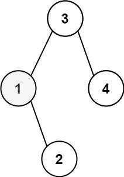
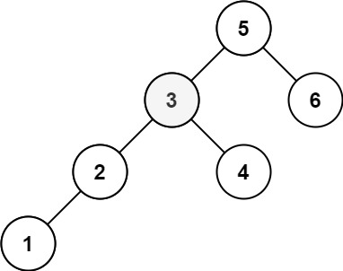

# [230. 二叉搜索树中第K小的元素](https://leetcode.cn/problems/kth-smallest-element-in-a-bst/description/?envType=study-plan-v2&envId=top-100-liked) 

给定一个二叉搜索树的根节点 root ，和一个整数 k ，请你设计一个算法查找其中第 k 小的元素（从 1 开始计数）。

示例 1：

输入：root = [3,1,4,null,2], k = 1
输出：1
示例 2：

输入：root = [5,3,6,2,4,null,null,1], k = 3
输出：3

提示：

树中的节点数为 n 。
1 <= k <= n <= 104
0 <= Node.val <= 104

进阶：如果二叉搜索树经常被修改（插入/删除操作）并且你需要频繁地查找第 k 小的值，你将如何优化算法？