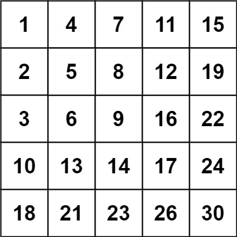

# 240. 搜索二维矩阵 II

编写一个高效的算法来搜索 m x n 矩阵 matrix 中的一个目标值 target 。该矩阵具有以下特性：

每行的元素从左到右升序排列。
每列的元素从上到下升序排列。

示例 1：

输入：matrix = [[1,4,7,11,15],[2,5,8,12,19],[3,6,9,16,22],[10,13,14,17,24],[18,21,23,26,30]], target = 5
输出：true
示例 2：

输入：matrix = [[1,4,7,11,15],[2,5,8,12,19],[3,6,9,16,22],[10,13,14,17,24],[18,21,23,26,30]], target = 20
输出：false

提示：

m == matrix.length
n == matrix[i].length
1 <= n, m <= 300
-109 <= matrix[i][j] <= 109
每行的所有元素从左到右升序排列
每列的所有元素从上到下升序排列
-109 <= target <= 109

157 160 165 167 170 176 182 188 194 200
165 171 174 179 181 187 191 195 199 202
162 165 169 173 176 182 188 194 198 204
176 178 182 184 187 191 194 197 200 206
174 178 180 186 192 196 202 206 208 210
165 171 177 183 188 192 197 203 208 214
185 189 191 194 200 202 208 211 216 219
190 194 199 204 210 212 215 217 221 223
192 194 198 201 206 208 211 217 222 228
199 202 204 208 211 217 221 224 229 231